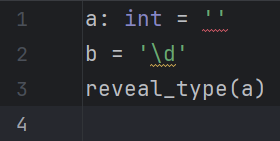

# CLI-specific configurations

## Configuration file

!!! note

    This configuration is [deliberately][1] unsupported by LSP.
    The language server will search for the configuration file(s)
    inside the root directory of the workspace.

Despite being called "file", this can be a path to a directory
containing a `pyrightconfig.json` and/or a `pyproject.toml`
(the former takes precedence if both are present).
This path will be passed to the executable via [the `--project` option][2].

* If the executable is local, only the local path is used.
* If the executable is global, the local path is used if it is specified,
  falling back to the global one.

If the path retrieved using the aforementioned strategy is not specified,
the project directory is used.

## Process timeout

Modify this option to set a maximum limit (in milliseconds)
each process should take before it is forcibly destroyed.

A value of <i>-1</i> disables the timeout.

Default: <i>10 seconds</i>.

!!! warning

    If there is no time limit, the process might run indefinitely,
    leading to undesired CPU and RAM usage.

## Minimum severity level

Modify this option to set a minimum threshold that
only the diagnostics whose severity is equal or higher than it
will be emitted.

This corresponds to the `--level` option.

Default: <i>Information</i>

=== "Information"

    

=== "Warning"

    

=== "Error"

    

  [1]: https://github.com/microsoft/pyright/discussions/7650
  [2]: https://microsoft.github.io/pyright/#/command-line
