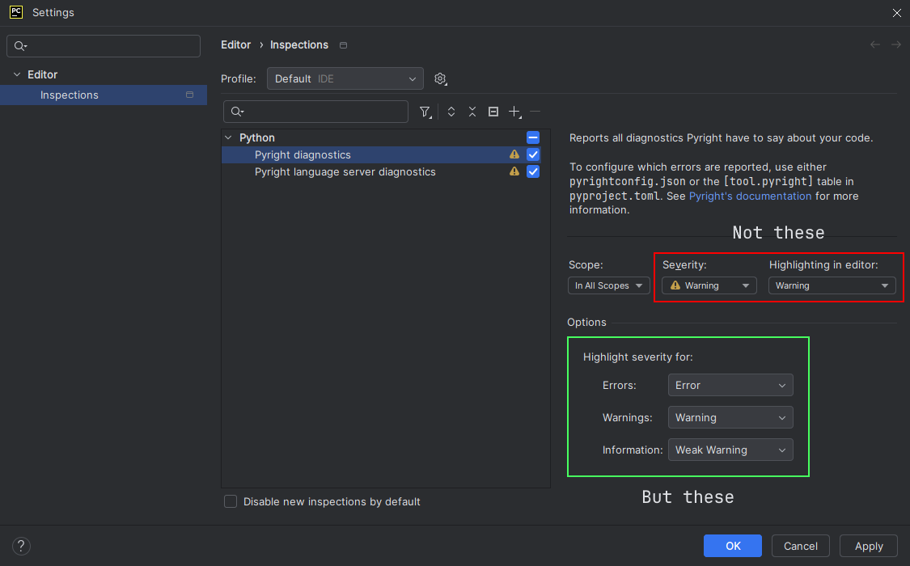
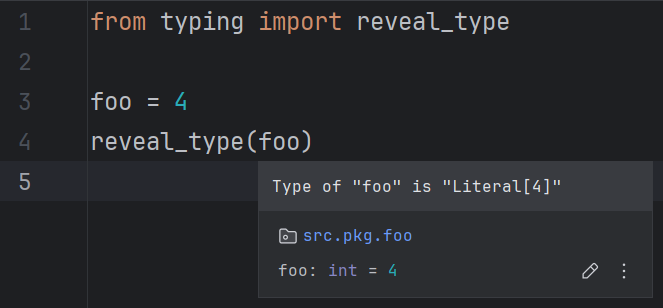
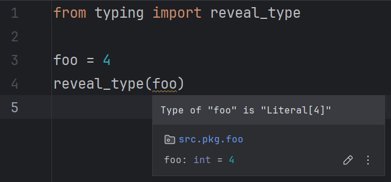

# Common configurations

## Executable

For CLI/LSP to work, at least one executable file needs to be defined
using either the <b>Global</b> or <b>Project</b> panel.

!!! question "[How do I install the executable(s)?][1]"

Such a file is typically named `pyright`/`pyright-python` (CLI)
or `pyright-langserver`/`pyright-python-langserver` (LSP)
and can likely be found in:

!!! note

    The locations mentioned here are for Pip and NPM-like managers.
    For other tools (e.g. Homebrew), see their documentation
    to know where they store their executable files.

| Manager | Type   | OS      | Directory                                          |
|:--------|:-------|:--------|:---------------------------------------------------|
| NPM     | Global | Windows | `%APPDATA%\npm`                                    |
| NPM     | Global | Linux   | `/usr/local/bin`                                   |
| Pip     | Global | Windows | `%LOCALAPPDATA%\Programs\Python\<version>\Scripts` |
| Pip     | Global | Linux   | `~/.local/bin`                                     |
| NPM     | Local  | Windows | `.\node_modules\.bin`                              |
| NPM     | Local  | Linux   | `./node_modules/.bin`                              |
| Pip     | Local  | Windows | `.\<your-venv>\Scripts`                            |
| Pip     | Local  | Linux   | `./<your-venv>/bin`                                |

??? question "What's the difference between these files?"

    [TLDR][2]: Some may output "unexpected" things.

If the executables can't be found in the aforementioned locations,
see the following pages for more information:

* <i>[Where does npm install packages?][3]</i> - <i>Stack Overflow</i>
* <i>[Where does pip install its packages?][4]</i> - <i>Stack Overflow</i>
* <i>[folders][5]</i> - <i>npm Docs</i>

You can also use a relative path.
It would be interpreted as relative to the project directory.

The executable is used as-is with no additional checks,
so CLI/LSP will still work even if, for example,
it's a wrapper script that outputs diagnostics in the expected format.

## Always use global

Check this option to always use the global executable
and configuration file.

Default: `false`

## Use editor font

Check this option to display tooltips in the editor font.
This option is not applied retroactively;
you need to make an edit to see the effect.

Default: `false`

=== "Enabled"

    

=== "Disabled"

    

## Add prefix to tooltips

Check this option to prefix tooltips with "Pyright:".
This option is not applied retroactively;
you need to make an edit to see the effect.

Default: `false`

=== "Enabled"

    

=== "Disabled"

    

## Auto-suggest executable

Check this option to automatically find and
suggest an executable for the current project on open.
See [the corresponding feature][6] for more information.

Default: `true`

## Highlight severity levels

Pyright diagnostics have [three possible levels][7]:
Error, warning, and information.
These can be mapped to different highlight severity levels in the IDE.

!!! note

    The language server may also output "hint" diagnostics
    that report code as ["unnecessary" or "deprecated"][8].
    This level is not configurable via the UI.

### Configuring

The target levels can be configured by modifying the options provided
at <b>Editor</b> | <b>Inspections</b> -->
<i>Pyright diagnostics</i> / <i>Pyright language server diagnostics</i>.

!!! note ""

    Only the levels defined in the select boxes
		under the <i>Options</i> pane are honored.

For each diagnostic level, there are four highlight levels to choose from:

| Level        | Default effects       |
|--------------|-----------------------|
| Error        | Red squiggles         |
| Warning      | Yellow squiggles      |
| Weak warning | Dark yellow squiggles |
| Information  | No visible effects    |

!!! note ""

    These levels are semantic, not visual.

The <i>Information</i> level is the only one not considered
"problematic" by the IDE. Annotations of this kind
will not be reported as "problems" during batch inspections
(<i>File</i>, <i>Project Errors</i> and similar tabs in
the <i>Problems</i> tool window).

!!! note

    Despite having no visible effects,
    <i>Information</i> annotations are still shown on hover.

    === "Information"

        

    === "Weak warning"

        

### Recommended levels

| Diagnostic  | For most users (default) | For lax users |
|-------------|--------------------------|---------------|
| Error       | Error                    | Warning       |
| Warning     | Warning                  | Weak warning  |
| Information | Weak warning             | Weak warning  |

  [1]: ../how-to.md#how-to-install-the-pyright-executables
  [2]: ../faq.md#whats-the-difference-between-the-pyright-and-pyright-python-files
  [3]: https://stackoverflow.com/q/5926672
  [4]: https://stackoverflow.com/q/29980798
  [5]: https://docs.npmjs.com/cli/v10/configuring-npm/folders#executables
  [6]: ../features.md#executable-suggestion
  [7]: https://microsoft.github.io/pyright/#/configuration?id=type-check-diagnostics-settings
  [8]: https://microsoft.github.io/language-server-protocol/specifications/lsp/3.17/specification/#diagnosticTag
