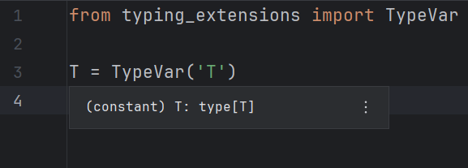
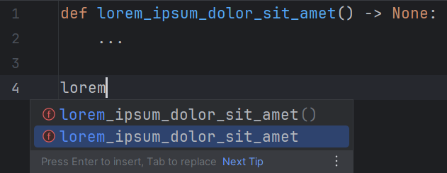
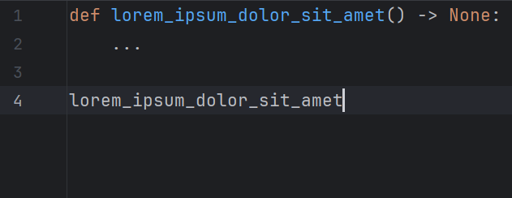
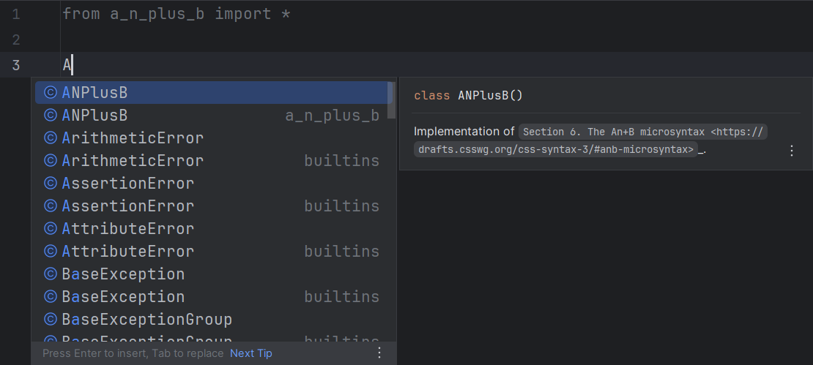
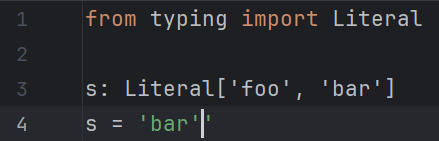

# LSP-specific configurations

## Tooltips

These options are not applied retroactively;
you need to make an edit to see the effect.

### Link error codes

Enable this option to display error codes as links.

Default: `false`

=== "Enabled"

    

=== "Disabled"

    

## Language server settings

These settings are not applied retroactively;
the server needs to be [restarted][1] for them to have effects.

### Auto-restart server

Check this option to automatically restart
the language server on configuration change.

[Highlight severity level settings][2]
will not trigger this behaviour.

Default: `false`

!!! note

    The server might be restarted more than once if
    both configuration panels are modified.

### Completion support

Check this option to enable completion support.

Default: `false`

=== "Enabled"

    

=== "Disabled"

    

!!! note

    The autocompletion result might not precisely
    follow the server's response due to
    a few custom modifications employed by the plugin
    to monkeypatch IDE bugs (e.g. [IJPL-155741][3]).

### Diagnostics support

Uncheck this option to disable diagnostics support.

Default: `true`

=== "Enabled"

    

=== "Disabled"

    

### Go-to-definition support

Check this option to enable go-to-definition support.

Default: `false`

!!! note

    As of yet, PyCharm's native support is
    prioritized over the language server's.

    This means <kbd>Ctrl</kbd> <kbd>B</kbd> (or similar shortcuts)
    will only trigger PyCharm's support on tokens it can handle
    (that is, most of them).

    The difference between the set of all tokens which Pyright support
    and that of PyCharm is currently unknown.

    See [this issue][4] for more information.

### Hover support

Uncheck this option to disable hover support.

Default: `true`

=== "Enabled"

    

=== "Disabled"

    

### Autocomplete parentheses

Check this option to also automatically insert parentheses
for function, method and constructor completions.

Default: `false`

=== "Before"

    

=== "Disabled"

    

=== "Enabled"

    

### Auto-import completions

Uncheck this option to prevent the language server from offering
completions which, if accepted, will also add a `import` statement
for that newly introduced symbol.

This corresponds to the `python.analysis.autoImportCompletions` setting.

Default: `true`

=== "Auto-import completions enabled"

    

=== "Auto-import completions disabled"

    

=== "Completion support disabled"

    

### Add common search paths

Uncheck this option to tell the language server not to add
common search paths like `src` when there are
no execution environments defined in the configuration file.

This corresponds to the `python.analysis.autoSearchPaths` setting.

Default: `true`

### Diagnostic mode

!!! note

    This option's usefulness is as of yet unknown.

Modify this option to control the number of files
for which the language server will analyze and report diagnostics.

This corresponds to the `python.analysis.diagnosticMode` setting.

Default: *Open files only*

### Log level

!!! note

    Language server logs are not recorded in `idea.log` by default.
    You need to manually [enable it][5].

Modify this option to make the language server
emit more or less [log messages][6].

This corresponds to the `python.analysis.logLevel` setting.

Default: <i>Information</i>

### Monkeypatch auto-import details

Uncheck this option to prevent the original completion item detail
("<i>Auto-import</i>" or a similar localized message)
from being overridden by its import source.

Default: `true`

=== "Enabled"

    

=== "Disabled"

    

### Monkeypatch trailing quote bug

Uncheck this option to use the IDE's native implementation
when applying quoted completions,
which may insert extraneous trailing quotes.

Default: `true`

=== "Before"

    

=== "Enabled"

    

=== "Disabled"

    

### Tagged hints

Uncheck this option to prevent the language server from emitting
"Unnecessary" and "Deprecated" hints, which are visualized in the IDE
as faded-out and strikethrough text, correspondingly.

This corresponds to the `pyright.disableTaggedHints` setting.

Default: `true`

=== "Enabled"

    

=== "Disabled"

    

### Targeted file extensions

A file whose extension is included in this list will be recognized
as suitable for the language server to run on.
This is useful if you use a server
whose support range is wider than that of Pyright.

Each extension should be written on one line when the editor is expanded.
Otherwise, use the pipe character (`|`) to separate them.

Leading and trailing whitespace are stripped away.
Blank extensions are thus considered invalid.

Default: `py`, `pyi`

!!! note

    Presumably, due to a limitation/bug of IntelliJ,
    characters like "🔥" (U+1F525 Fire, the extension for [Mojo][7])
    cannot be serialized correctly into setting files
    and therefore will not persist between IDE sessions.

    Testing shows that this affects characters
    whose codepoints are greater than U+FFFD.

### Workspace folders

The folders defined by this option will be passed
to the language server as "[workspace folders][8]".
Pyright will only recognize `pyproject.toml`/`pyrightconfig.json` files
which are direct children of these folders.

Possible choices:

* <i>Project base directories</i>:
  Top-level directories which contain files related to the project,
  often only one (project root).
* <i>Source roots</i>:
  Directories marked as "[source roots][9]".

Default: <i>Project base directories</i>

  [1]: ../how-to.md#how-to-restart-the-language-server
  [2]: ./common.md#highlight-severity-levels
  [3]: https://youtrack.jetbrains.com/issue/IJPL-155741
  [4]: https://github.com/InSyncWithFoo/pyright-langserver-for-pycharm/issues/29
  [5]: ../how-to.md#how-to-enable-language-server-logging
  [6]: https://microsoft.github.io/language-server-protocol/specifications/lsp/3.17/specification/#window_logMessage
  [7]: https://en.wikipedia.org/wiki/Mojo_(programming_language)
  [8]: https://microsoft.github.io/language-server-protocol/specifications/lsp/3.17/specification/#workspace_workspaceFolders
  [9]: https://www.jetbrains.com/help/pycharm/content-root.html
