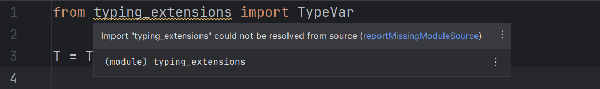
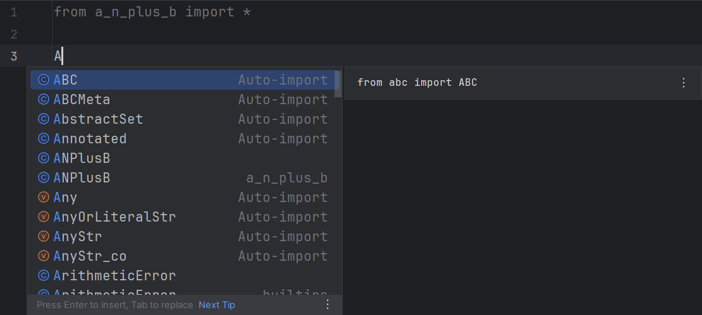

# LSP-specific configurations

## Tooltips

These options are not applied retroactively;
you need to make an edit to see the effect.

### Link error codes

Enable this option to display error codes as links.

Default: `false`

=== "Enabled"

    

=== "Disabled"

    

## Language server settings

These settings are not applied retroactively;
you need to [restart the server][1] to see the effect.

### Hover support

Uncheck this option to disable hover support.

Default: `true`

=== "Enabled"

    

=== "Disabled"

    

### Completion support

Check this option to enable completion support.

Default: `false`

=== "Enabled"

    

=== "Disabled"

    

### Go-to-definition support

Check this option to enable go-to-definition support.

Default: `false`

### Tagged hints

Uncheck this option to prevent the language server from emitting
"Unnecessary" and "Deprecated" hints, which are visualized in the IDE
as faded-out and strikethrough text, correspondingly.

This corresponds to the `pyright.disableTaggedHints` setting.

Default: `true`

=== "Enabled"

    

=== "Disabled"

    

### Log level

!!! warning

    Language server logs are not recorded in `idea.log` by default.
    You need to manually [enable it][2].

Modify this option to make Pyright emit more or less [log messages][3].

This corresponds to the `python.analysis.logLevel` setting.

Default: <i>Information</i>

### Workspace folders

The folders defined by this option will be passed
to the language server as "[workspace folders][4]".
Pyright will only recognize `pyproject.toml`/`pyrightconfig.json` files
which are direct children of these folders.

Possible choices:

* <i>Project base directories</i>:
  Top-level directories which contain files related to the project,
  often only one (project root).
* <i>Source roots</i>:
  Directories marked as "[source roots][5]".

Default: <i>Project base directories</i>

  [1]: ../how-to.md#how-to-restart-the-language-server
  [2]: ../how-to.md#how-to-enable-language-server-logging
  [3]: https://microsoft.github.io/language-server-protocol/specifications/lsp/3.17/specification/#window_logMessage
  [4]: https://microsoft.github.io/language-server-protocol/specifications/lsp/3.17/specification/#workspace_workspaceFolders
  [5]: https://www.jetbrains.com/help/pycharm/content-root.html
