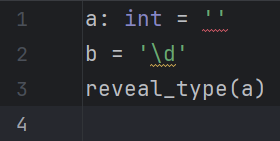
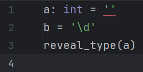

# Other settings

## Tooltip settings

These options are not applied retroactively;
you need to make an edit to see the effect.

### Use editor font

| Used by running mode(s) | Default |
|-------------------------|---------|
| Command line            | `false` |

Enable this setting to display tooltips in the editor font.

=== "Enabled"

    

=== "Disabled"

    

### Add prefix

| Used by running mode(s) | Default |
|-------------------------|---------|
| Command line            | `false` |

Enable this setting to prefix tooltips with "Pyright:".

=== "Enabled"

    

=== "Disabled"

    

## Command-line-mode-specific settings

### Process timeout

| Default           | Corresponding CLI option |
|-------------------|--------------------------|
| <i>10 seconds</i> | N/A                      |

Modify this setting to set a maximum limit (in milliseconds)
each process should take before it is forcibly destroyed.

A value of <i>-1</i> disables the timeout.

!!! warning

    If there is no time limit, the process might run indefinitely
    in cases of bugs, leading to undesired CPU and RAM usage.

### Number of threads

| Default  | Corresponding CLI option |
|----------|--------------------------|
| <i>0</i> | `--threads`              |

Modify this setting to paralellize type checking
on up to the specified number of threads.

A value of <i>0</i> means nothing is passed to the executable.

!!! warning

    The `--thread` option is only available in Pyright 1.1.371 and later.
    Modifying it will cause an error for older versions.

## Minimum severity level

| Default            | Corresponding CLI option |
|--------------------|--------------------------|
| <i>Information</i> | `--level`                |

Modify this setting to set a minimum threshold that
only diagnostics whose severity is equal or higher than it
will be emitted.

=== "Information"

    

=== "Warning"

    

=== "Error"

    

## Locale

| Default        | Corresponding environment variable |
|----------------|------------------------------------|
| <i>Default</i> | `LC_ALL`                           |

Modify this option to make the language server
emit messages in different languages.
