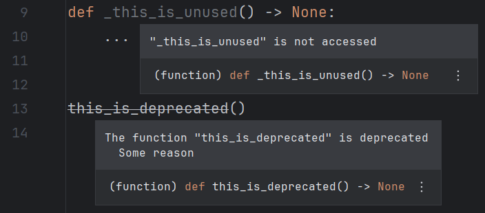
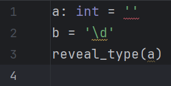
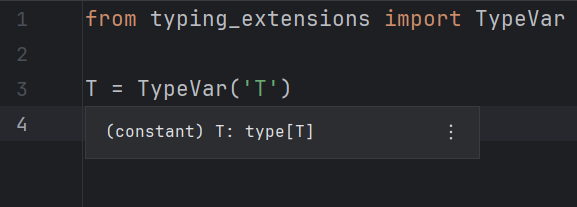

# Other settings

## Auto-restart server

Whether the language server should be
automatically restarted on configuration change.

Default: `true`

!!! note

    The server might be restarted more than once if
    both configuration panels are modified.

## Diagnostics

Whether diagnostics should be shown.

Default: `true`

=== "Enabled"
    

=== "Disabled"
    

### Use editor font for tooltips

Whether diagnostic tooltips should be displayed in the editor's font.

Monospaced messages might be more readable for
lengthy error messages with many embedded code parts.

Default: `false`

=== "Enabled"
    

=== "Disabled"
    

### Prefix tooltip messages

Whether messages in tooltips (and only in tooltips)
should be prefixed with "Pyright:".

Default: `false`

=== "Enabled"
    

=== "Disabled"
    

### Link error codes in tooltips

Whether error codes in tooltip messages should be
displayed as hyperlinks to Pyright's documentation.

Default: `false`

=== "Enabled"
    

=== "Disabled"
    

### Tagged hints

Whether the language server should emit "Unnecessary" and "Deprecated" hints,
which are visualized in the IDE as faded-out and strikethrough text.

This corresponds to the `pyright.disableTaggedHints` setting.

Default: `true`

=== "Enabled"
    

=== "Disabled"
    

### Minimum severity level

Only diagnostics whose severity is equal or higher than
this threshold will be emitted.

This corresponds to the `--level` CLI option.

Default: <i>Information</i>

=== "Information"
    

=== "Warning"
    

=== "Error"
    

## Type information on hover

Whether the language server should show the type,
signature and/or documentation when a symbol is hovered.

Default: `true`

=== "Enabled"
    

=== "Disabled"
    

## Autocompletion

Whether the language server should suggests potential completion items.

Default: `true`

=== "Enabled"
    

=== "Disabled"
    

!!! note

    The autocompletion result might be modified by the plugin
    depending on other configurations listed below.

### Auto-import completions

Whether the language server should offer completions which, if accepted,
will also add a `import` statement for that newly introduced symbol.

This corresponds to the `python.analysis.autoImportCompletions` setting.

Default: `true`

=== "Auto-import completions enabled"
    

=== "Auto-import completions disabled"
    

=== "Completion support disabled"
    

#### Monkeypatch auto-import details

Whether an auto-import completion item's detail
("<i>Auto-import</i>" or a similar localized message)
should be overridden by its import source (module, package, etc.).

Default: `true`

=== "Enabled"
    

=== "Disabled"
    

### Autocomplete parentheses

Check this option to also automatically insert parentheses
for function, method and constructor completions.

Default: `true`

=== "Before"
    

=== "Disabled"
    

=== "Enabled"
    

### Monkeypatch trailing quote bug

Uncheck this option to use the IDE's native implementation
when applying quoted completions,
which may insert extraneous trailing quotes.

Upstream issue: [IJPL-155741][1].

Default: `true`

=== "Before"
    

=== "Enabled"
    

=== "Disabled"
    

## Add common search paths

Whether the language server should add common search paths like `src`
when there are no execution environments defined in the configuration file.

This corresponds to the `python.analysis.autoSearchPaths` setting.

Default: `true`

## Targeted file extensions

A file whose extension is included in this list will be
recognized as suitable for the language server to run on.
This is useful if you use a server
whose support range is wider than that of Pyright.

Each extension should be written on one line when the editor is expanded.
Otherwise, use the pipe character (`|`) to separate them.

Leading and trailing whitespace are stripped away.
Blank extensions are thus considered invalid.

Default: `py`, `pyi`, `pyw`

!!! note

    Presumably, due to a limitation/bug of IntelliJ,
    characters like "🔥" (U+1F525 Fire, the extension for [Mojo][2])
    cannot be serialized correctly into setting files
    and therefore will not persist between IDE sessions.

    Testing shows that this affects characters
    whose codepoints are greater than U+FFFD.

## Workspace folders

The folders defined by this option will be passed
to the language server as "[workspace folders][3]".
Pyright will only recognize `pyproject.toml`/`pyrightconfig.json` files
which are direct children of these folders.

Possible choices:

* <i>Project base directories</i>:
  Top-level directories which contain files related to the project,
  often only one (project root).
* <i>Source roots</i>:
  Directories marked as "[source roots][4]".

Default: <i>Project base directories</i>

## Diagnostic mode

!!! note

    This option's usefulness is as of yet unknown.

Modify this option to control the number of files
for which the language server will analyze and report diagnostics.

This corresponds to the `python.analysis.diagnosticMode` setting.

Default: <i>Open files only</i>

## Log level

!!! note

    Language server logs are not recorded in `idea.log` by default.
    You need to manually [enable it][5].

Modify this option to make the language server
emit more or less log messages.

This corresponds to the `python.analysis.logLevel` setting.

Default: <i>Information</i>

## Locale

| Default        | Corresponding environment variable |
|----------------|------------------------------------|
| <i>Default</i> | `LC_ALL`                           |

The language Pyright should emit messages in.

This corresponds to the `LC_ALL` environment variable.

Default: <i>Default</i> (unspecified)

## Number of threads

The number of threads to paralellize type checking on.
A value of <i>0</i> means nothing is passed to the executable.

This corresponds to the `--threads` CLI option.

Default: <i>0</i>

!!! warning

    The `--thread` option is only available in Pyright 1.1.371 and later.
    Modifying it will cause an error for older versions.

  [1]: https://youtrack.jetbrains.com/issue/IJPL-155741
  [2]: https://www.modular.com/mojo
  [3]: https://microsoft.github.io/language-server-protocol/specifications/lsp/3.17/specification/#workspace_workspaceFolders
  [4]: https://www.jetbrains.com/help/pycharm/content-root.html
  [5]: ../how-to.md#how-to-enable-language-server-logging
