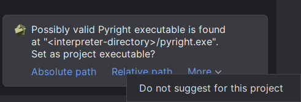
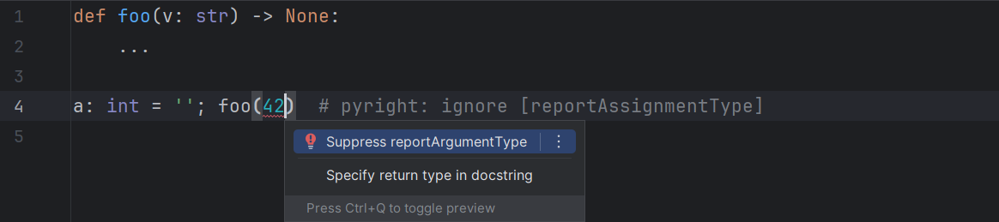
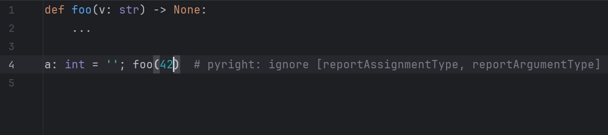
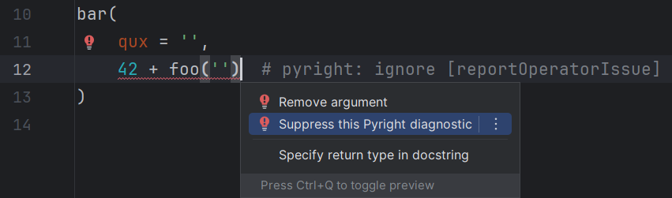
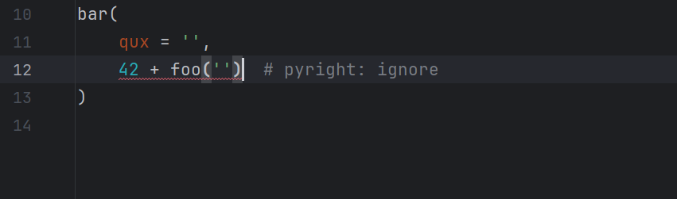
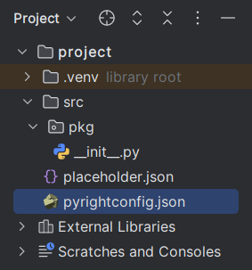
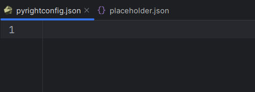
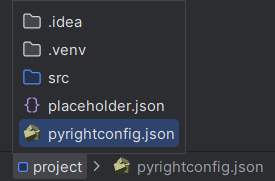

# Other features

## Executable suggestion

When a project is opened, a suggestion to set a file
as the executable for that project is shown if:

* The interpreter of the project exists and is located inside it.
* There is a file named `pyright`/`pyright-langserver`
  (with or without extension) among the siblings of the interpreter.
* The project executable is not yet given.
* The global executable is not preferred.

Available actions:

* Absolute path: Set the absolute path.
* Relative path: Set the relative path (no leading dot).
* Do not suggest: Turn off [the corresponding setting][1].

## Suppressing diagnostics using quick fixes

Most diagnostics can be suppressed using
their corresponding quick fixes:

=== "Before"

    

=== "After"

    

If a comment already presents on that line,
the new error code will be appended to the end of the list:

=== "Before"

    

=== "After"

    

If the error has no corresponding code,
the entire list will be removed:

=== "Before"

    

=== "After"

    

### `pyrightconfig.json` file icon

In file-related views, the default JSON file icon
for the `pyrightconfig.json` file is replaced with Pyright's logo.

<figure markdown="1">
  <figcaption><i>Project</i> tool window:</figcaption>
  
</figure>

<figure markdown="1">
  <figcaption>Editor tabs:</figcaption>
  
</figure>

<figure markdown="1">
  <figcaption>Breadcrumbs:</figcaption>
  
</figure>

  [1]: configurations/executables.md#auto-suggest-executable
