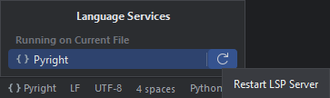

## How to install the Pyright executables

Choose one that works for you (or one you like the most):

!!! tip "Your favourite tool is not here? [Submit a PR!][1]"

```shell
$ pip install pyright
$ uv pip install pyright
$ npm install pyright
$ yarn add pyright
$ pnpm install pyright
$ bun install pyright
$ brew install pyright
```

See also [Pyright's official installation guide][2].


## How to restart the language server

In the status bar, find the cell that has
"Pyright" next to a pair of braces.
Click it, then click the loop icon.




  [1]: https://github.com/InSyncWithFoo/pyright-for-pycharm/blob/master/CONTRIBUTING.md
  [2]: https://microsoft.github.io/pyright/#/installation?id=command-line
