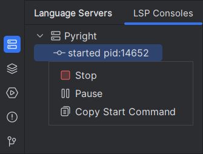
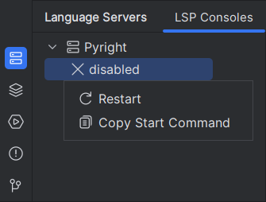

## How to install the Pyright executables

Choose one that works for you:

```shell
$ pip install pyright
$ uv pip install pyright
$ npm install pyright
$ yarn add pyright
$ pnpm install pyright
$ bun install pyright
$ brew install pyright
```

See also [Pyright's official installation guide][1].


## How to restart the language server

From the <i>LSP Consoles</i> of the <i>Language Servers</i> toolwindow,
find the line that says "Pyright".

Right click the line below it, then click "Stop".
The line should then say "Disabled".
Right click that line again, then click "Restart".

=== "Stop"

    

=== "Restart"

    


  [1]: https://microsoft.github.io/pyright/#/installation?id=command-line
