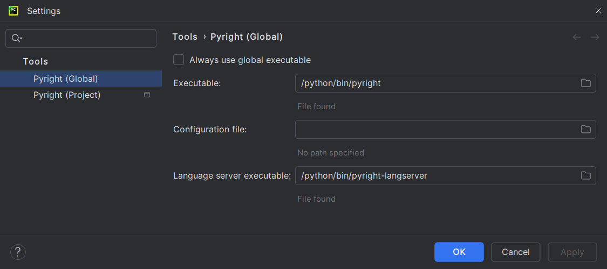
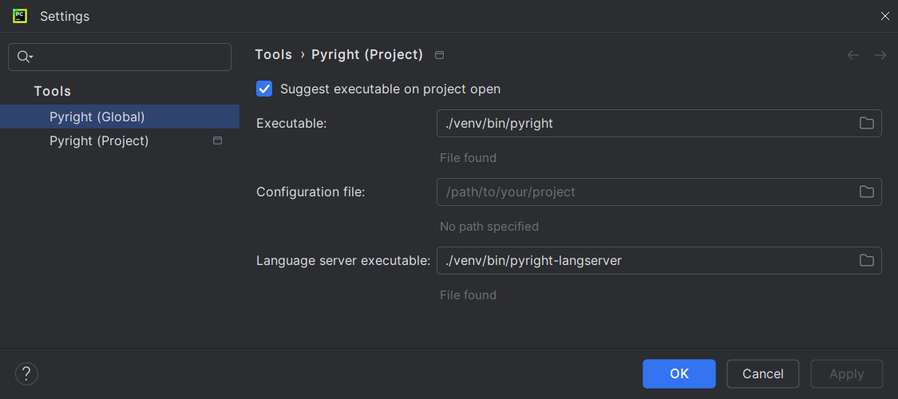

# Pyright for PyCharm user documentation

This site serves as the user documentation for
[the <i>Pyright</i> PyCharm plugin][1].

The plugin runs and reroutes Pyright's diagnostics back to your IDE.
Both PyCharm Professional and PyCharm Community users can use it.

??? question "Looking for the old LSP plugin?"

    It now has [its own documentation site][2].

## Usage

Go to <b>Settings</b> | <b>Tools</b> |
<b>Pyright (Global)</b> / <b>Pyright (Project)</b>
and set the path to [your Pyright executable(s)][3].

=== "Global"

    

=== "Project"

    

Save, return to your files and start making some modifications.
You should see Pyright annotations in a few seconds.
If not, refer to <i>[Problems and solutions][4]</i>.

  [1]: https://plugins.jetbrains.com/plugin/24145
  [2]: https://insyncwithfoo.github.io/pyright-langserver-for-pycharm
  [3]: configurations/executables.md
  [4]: problems.md
