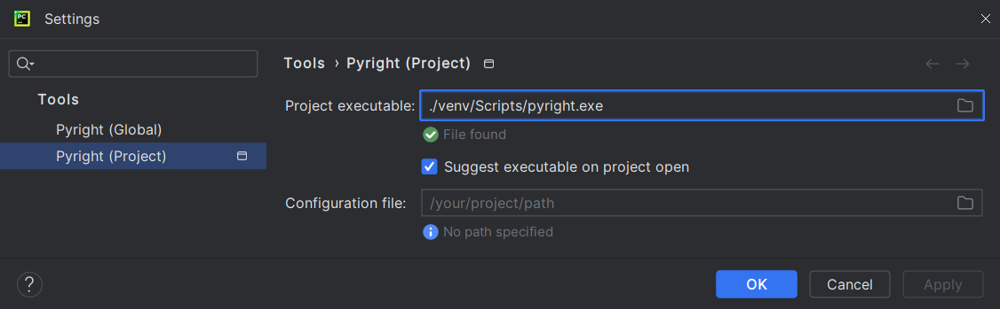

# Pyright for PyCharm user documentation

## Usage

Go to <b>Settings</b> | <b>Tools</b> |
<b>Pyright (Global)</b> / <b>Pyright (Project)</b>
and set the path to [your Pyright executable][1].

Save, return to your file and start making some modifications.
You should see Pyright annotations in a few seconds.

  [1]: configurations.md#executable
