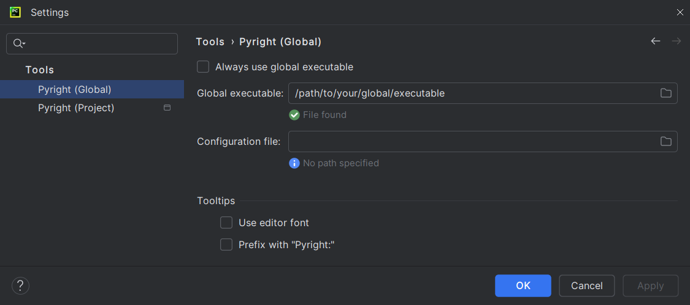
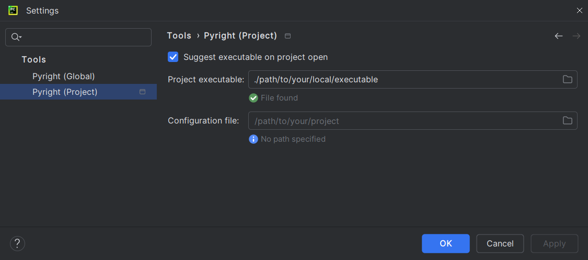
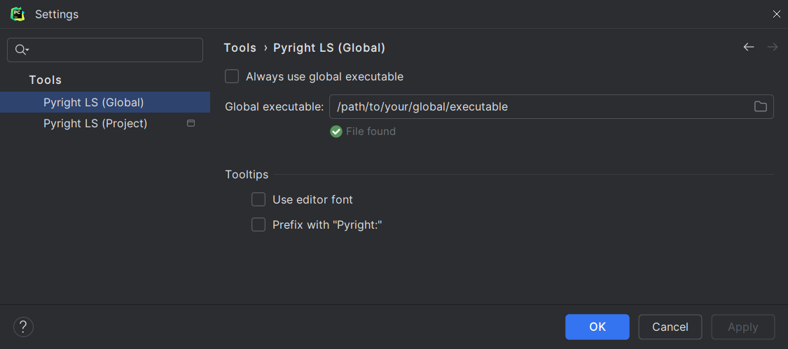
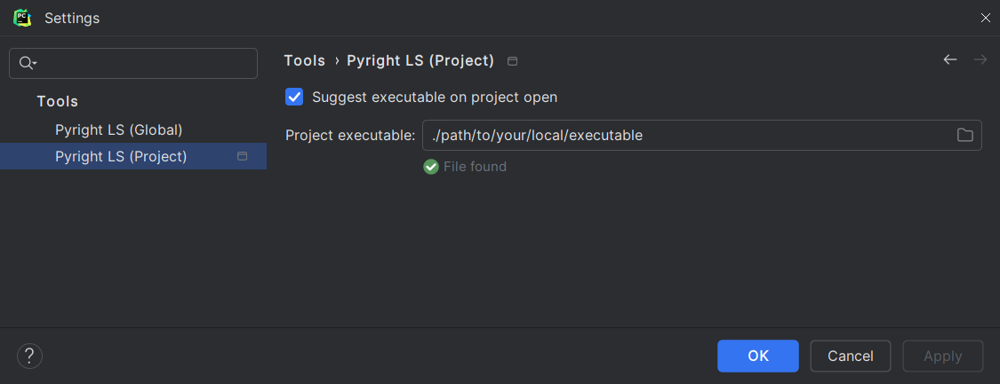

=== "CLI"

    Go to <b>Settings</b> | <b>Tools</b> |
    <b>Pyright (Global)</b> / <b>Pyright (Project)</b>
    and set the path to [your Pyright executable][1].
    
    
    
    
    Save, return to your file and start making some modifications.
    You should see Pyright annotations in a few seconds.
    If not, refer to <i>[Problems and solutions][2]</i>.

=== "LSP"

    Go to <b>Settings</b> | <b>Tools</b> |
    <b>Pyright LS (Global)</b> / <b>Pyright LS (Project)</b>
    and set the path to [your Pyright language server executable][1].
    
    
    

    You might need to reopen your files or restart the IDE
    for the files to be recognized by the language server.
    If that doesn't work, refer to <i>[Problems and solutions][2]</i>.

  [1]: configurations/common.md#executable
  [2]: problems.md
